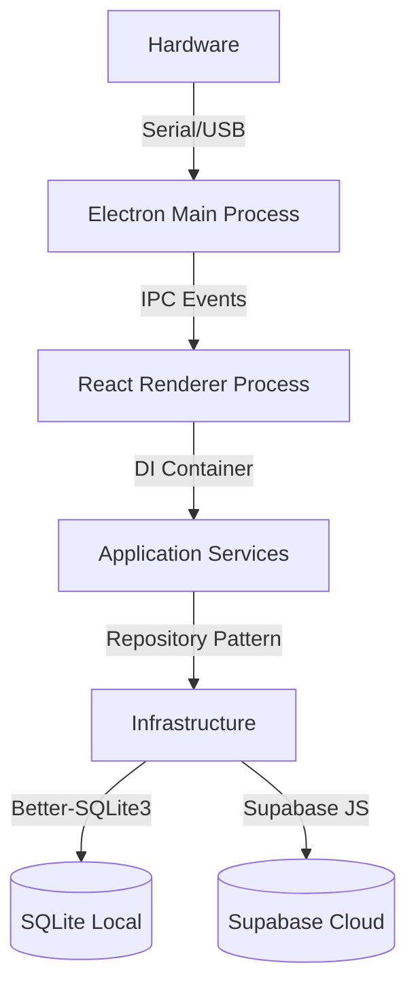

# Manual Técnico - Arquitectura, Datos y Protocolos - Gravio

## 1. Visión General de la Arquitectura

Gravio es una aplicación de escritorio de alto rendimiento diseñada con arquitectura híbrida **Electron + React**, optimizada para entornos industriales con conectividad intermitente (Offline-First).

### 1.1. Diagrama de Componentes



### 1.2. Stack Tecnológico
*   **Runtime**: Electron 28+ (Chromium + Node.js).
*   **Frontend**: React 18, TypeScript 5, Vite, TailwindCSS.
*   **Estado**: Zustand (Gestión global ligera).
*   **Base de Datos Local**: `better-sqlite3` (Acceso síncrono de alto rendimiento).
*   **Nube**: Supabase (PostgreSQL, Auth, Realtime, Storage).
*   **Hardware**: `serialport` (Comunicación RS-232), `electron-printer` (Impresión nativa).

---

## 2. Base de Datos y Esquema

El sistema utiliza dos bases de datos espejo: una local (SQLite) y una en la nube (PostgreSQL). Ambas comparten el mismo esquema lógico para facilitar la sincronización.

### 2.1. Tablas Core (`electron/database.ts`)

#### `registros`
La tabla transaccional principal. Almacena cada evento de pesaje.
```sql
CREATE TABLE registros (
  id TEXT PRIMARY KEY,           -- UUID v4
  folio TEXT,                    -- Generado: PREF-000000
  tipo_pesaje TEXT,              -- 'entrada', 'salida', 'completo'
  peso_entrada REAL,             -- Kg
  peso_salida REAL,              -- Kg (Nullable)
  peso_neto REAL GENERATED ALWAYS AS (peso_entrada - peso_salida) VIRTUAL,
  fecha_entrada TEXT,            -- ISO8601
  fecha_salida TEXT,             -- ISO8601
  placa_vehiculo TEXT NOT NULL,
  numero_economico TEXT,
  clave_empresa INTEGER,
  clave_operador INTEGER,
  clave_ruta INTEGER,
  clave_concepto INTEGER,
  sincronizado INTEGER DEFAULT 0 -- 0: Pendiente, 1: Synced
);
```

#### `vehiculos`
Catálogo de unidades.
```sql
CREATE TABLE vehiculos (
  id TEXT PRIMARY KEY,
  placas TEXT UNIQUE,
  no_economico TEXT,
  clave_empresa INTEGER,
  tara_actual REAL,
  updated_at INTEGER
);
```

#### `folio_sequences`
Control crítico para la generación de folios offline.
```sql
CREATE TABLE folio_sequences (
  clave_empresa INTEGER PRIMARY KEY,
  prefijo_empresa TEXT,          -- Ej: 'GRAV'
  ultimo_numero INTEGER,         -- Contador incremental
  sincronizado INTEGER DEFAULT 0
);
```

---

## 3. Protocolos de Comunicación (IPC)

La seguridad es prioritaria. El proceso `Renderer` (UI) no tiene acceso directo a Node.js. Toda la comunicación pasa por un `ContextBridge` definido en `preload.ts`.

### 3.1. Canales de Eventos

| Canal | Dirección | Payload | Descripción |
| :--- | :--- | :--- | :--- |
| `serial:list` | UI -> Main | `void` | Solicita lista de puertos COM. |
| `serial:open` | UI -> Main | `{port, baud}` | Inicia conexión con báscula. |
| `serial:data` | Main -> UI | `string` | Emite trama de peso cruda (ej. `)0 1200`). |
| `db:query` | UI -> Main | `{sql, params}` | Ejecuta consulta SQL segura. |
| `printer:print` | UI -> Main | `{html, printer}` | Envía trabajo de impresión a ventana oculta. |

---

## 4. Motor de Sincronización (`SyncService`)

El corazón de la capacidad "Offline-First". Funciona en dos direcciones.

### 4.1. Upstream (Subida: Local -> Nube)
1.  **Trigger**: Intervalo de 5 min o evento `navigator.onLine`.
2.  **Query**: `SELECT * FROM registros WHERE sincronizado = 0`.
3.  **Acción**: Itera y envía a Supabase usando `upsert` (idempotencia).
4.  **Confirmación**: Si HTTP 200, marca `sincronizado = 1` localmente.

### 4.2. Downstream (Bajada: Nube -> Local)
1.  **Catálogos**: Descarga `Empresas`, `Vehiculos`, `Rutas` donde `updated_at > last_sync`.
2.  **Registros**: Descarga registros modificados en otras estaciones.
3.  **Resolución de Conflictos (Algoritmo)**:
    *   Si un registro existe en ambos lados, se cuentan los campos llenos (`peso_salida`, `fecha_salida`).
    *   **Regla de Oro**: "Gana el que tenga más información".
    *   *Protección*: Si el local tiene cambios pendientes de subir (`sincronizado=0`), se ignora la nube para no perder datos recientes.

---

## 5. Integración de Hardware

### 5.1. Báscula (Mettler Toledo)
*   **Parser**: Implementado en `electron/serialport.ts`.
*   **Lógica**:
    *   Lee flujo continuo de bytes.
    *   Detecta delimitador `\r` o `\n`.
    *   Parsea trama estándar: `[Estado] [Peso] [Tara]`.
    *   `Estado`: `)` = Estable, `(` = Inestable.

### 5.2. Impresora Térmica
*   **Renderizado**: No usa comandos ESC/POS directos para el texto.
*   **Técnica**: Genera un HTML en una `BrowserWindow` oculta (`width: 80mm`) y usa `webContents.print()` al driver del sistema. Esto permite usar CSS para estilos y logos sin lidiar con comandos binarios complejos.

---

## 6. Estructura del Proyecto

```bash
gravio-electron/
├── electron/                 # Proceso Principal (Node.js)
│   ├── main.ts              # Entry point, gestión de ventanas
│   ├── preload.ts           # Puente de seguridad IPC
│   ├── database.ts          # Inicialización SQLite
│   └── serialport.ts        # Driver de báscula
├── src/                      # Proceso Renderer (React)
│   ├── application/         # Casos de uso (Clean Arch)
│   ├── domain/              # Entidades y Reglas de Negocio
│   ├── infrastructure/      # Repositorios (SQLite/Supabase)
│   ├── components/          # UI Components (Shadcn)
│   └── lib/                 # Utilidades compartidas
└── manuales/                # Documentación generada
```

---

**Documentación Técnica Generada**: Diciembre 2025
**Versión de Arquitectura**: 2.1
